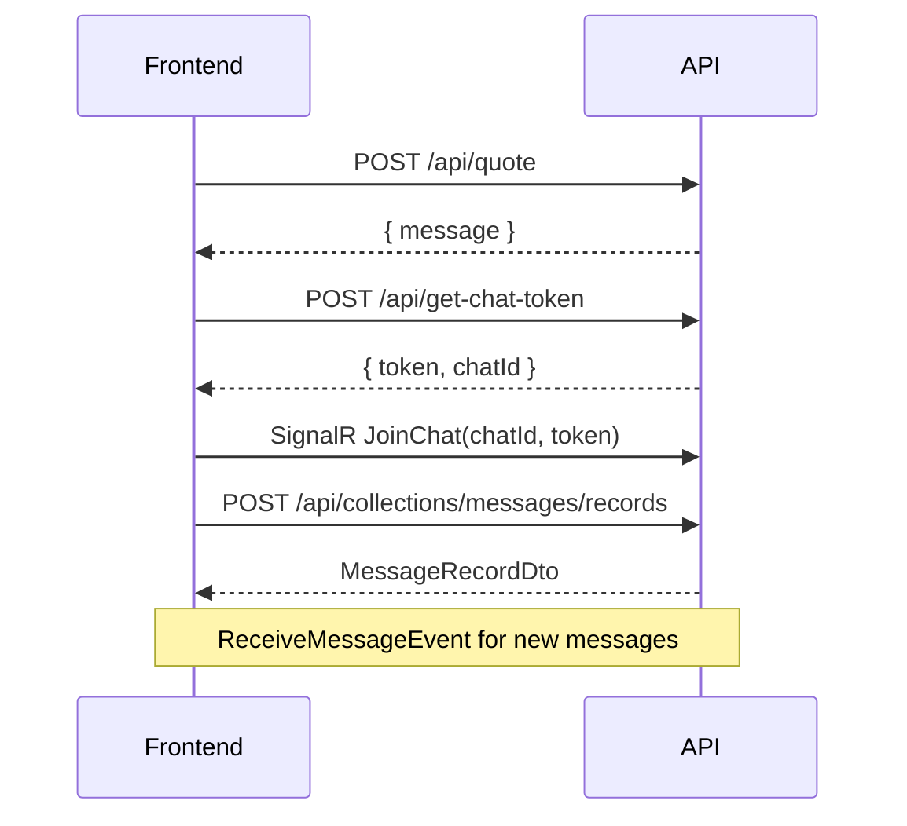

# SeasBroker Frontend API Guide

This document describes how the frontend should call the SeasBroker backend. The API uses **JSON over HTTP** with **camelCase** property names and is largely **PocketBase-compatible** for admin (superuser) flows.

---

## Base URLs

| Environment | URL |
|-------------|-----|
| Production | `https://api.seasbroker.com` |
| Local dev | `https://localhost:{port}` (see launch settings) |

All paths below are relative to the base URL.

---

## General conventions

### Headers

| Header | When |
|--------|------|
| `Content-Type: application/json` | All requests with a body |
| `Authorization: Bearer <token>` | Protected endpoints |

### JSON

- Request and response bodies use **camelCase** (`cargoListingId`, not `CargoListingId`).
- Dates/times are ISO 8601 (`2026-06-23T14:30:00Z` or with offset).
- Empty bodies are allowed where noted (e.g. `POST /api/matching/run` with `{}` or no body).

### CORS

The API allows **any origin**, all headers, all methods, and **credentials**. Configure your HTTP client with credentials if you rely on cookies (chat token cookie).

### Pagination

List endpoints that support pagination accept:

| Query param | Default | Description |
|-------------|---------|-------------|
| `page` | `1` | 1-based page number |
| `perPage` | `50` | Page size |

Paginated responses use this shape:

```json
{
  "page": 1,
  "perPage": 50,
  "totalItems": 120,
  "totalPages": 3,
  "items": []
}
```

### PocketBase-style filters

Some list endpoints accept a `filter` query string with a **limited** PocketBase-like syntax:

| Endpoint | Supported filter examples |
|----------|---------------------------|
| `GET /api/collections/cargoListings/records` | `status = "Open"`, `customer = "{uuid}"` |
| `GET /api/collections/vessels/records` | `status = "Active"` |
| `GET /api/collections/vesselAvailabilities/records` | `vesselId = "{uuid}"` |
| `GET /api/collections/matches/records` | `status = "PendingApproval"`, `cargoListingId = "{uuid}"`, `vesselId = "{uuid}"` |
| `GET /api/collections/messages/records` | `chatId = "{uuid}"` |

---

## Authentication

There are **two auth flows**. Use the one that matches your UI role.

### 1. Admin / superuser (PocketBase-compatible)

For the admin dashboard and all superuser-only endpoints.

#### Login

```http
POST /api/collections/_superusers/auth-with-password
Content-Type: application/json

{
  "identity": "admin@example.com",
  "password": "your-password"
}
```

> **Important:** The field is `identity`, **not** `email`.

**200 response:**

```json
{
  "token": "eyJhbGciOiJIUzI1NiIs...",
  "record": {
    "id": "uuid",
    "collectionId": "...",
    "collectionName": "_superusers",
    "created": "2026-01-01T00:00:00Z",
    "updated": "2026-01-01T00:00:00Z",
    "email": "admin@example.com",
    "verified": true
  }
}
```

Store `token` and send it as `Authorization: Bearer <token>` on protected routes.

#### Refresh

```http
POST /api/collections/_superusers/auth-refresh
Authorization: Bearer <current-token>
```

Returns the same shape as login with a new `token`.

---

### 2. Regular user auth

For standard user accounts (access + refresh token pair).

#### Login

```http
POST /api/auth/login
Content-Type: application/json

{
  "email": "user@example.com",
  "password": "your-password"
}
```

**200 response:**

```json
{
  "accessToken": "eyJhbGciOiJIUzI1NiIs...",
  "refreshToken": "base64-or-opaque-string",
  "expiresIn": 3600,
  "user": {
    "id": "uuid",
    "email": "user@example.com",
    "verified": true,
    "roles": ["User"],
    "created": "2026-01-01T00:00:00Z",
    "updated": "2026-01-01T00:00:00Z"
  }
}
```

- `expiresIn` is in **seconds** (default 3600 = 60 minutes).
- Refresh token lifetime defaults to **7 days**.

#### Refresh

```http
POST /api/auth/refresh
Content-Type: application/json

{
  "refreshToken": "..."
}
```

Returns the same shape as login with new tokens.

#### Logout

```http
POST /api/auth/logout
Authorization: Bearer <accessToken>
Content-Type: application/json

{
  "refreshToken": "..."
}
```

**204 No Content** on success.

---

### Which token for which endpoints?

| Audience | Token source | Header |
|----------|--------------|--------|
| Admin CRUD, matching, approval, etc. | Superuser login → `token` | `Authorization: Bearer <token>` |
| User notifications (REST + SignalR) | Either flow; user must be authenticated | `Authorization: Bearer <token>` |

Most admin endpoints require the **Superuser** role (issued via superuser login).

---

## Error responses

### Auth endpoints (`/api/auth/*`, `/api/collections/_superusers/*`)

```json
{
  "message": "Email and password are required.",
  "status": 400,
  "data": {}
}
```

Superuser invalid credentials return **401** with `"message": "Invalid login credentials."` (note: `status` in body may still be `400`).

### Business / PocketBase-style endpoints

```json
{
  "message": "Cargo listing not found.",
  "status": 404,
  "data": {}
}
```

Common HTTP status codes: `400`, `401`, `404`, `409`, `204` (delete/logout).

---

## Public endpoints (no auth)

### Submit a quote request

```http
POST /api/quote
Content-Type: application/json

{
  "cargoType": "Container",
  "weight": 1200.5,
  "departurePort": "Rotterdam",
  "departureTime": "2026-07-01",
  "arrivalPort": "Singapore",
  "arrivalTime": "2026-07-20",
  "dimensions": "40x40x40",
  "additionalInfo": "Optional notes",
  "fname": "Jane",
  "lname": "Doe",
  "email": "jane@example.com",
  "phoneNumber": "+1234567890"
}
```

**200 response:**

```json
{
  "message": "Quote request created successfully!",
  "id": "uuid",
  "requestedQuoteId": "uuid"
}
```

---

### List quote requests (admin)

```http
GET /api/collections/requestedQuotes/records?page=1&perPage=50
Authorization: Bearer <superuser-token>
```

Returns paginated public form submissions (quote, ship route, clearance, contact) with contact fields (`fname`, `lname`, `email`, `phoneNumber`).

---

### Get anonymous chat session

```http
POST /api/get-chat-token
```

No body required.

**200 response:**

```json
{
  "token": "anonymous-chat-token",
  "chatId": "uuid-of-new-or-existing-chat"
}
```

Also sets an HttpOnly cookie `chatToken` (24h). For cross-origin SPAs, prefer storing `token` from the JSON body and sending it in message requests.

---

### Send chat message (anonymous visitor)

```http
POST /api/collections/messages/records
Content-Type: application/json

{
  "token": "<from get-chat-token>",
  "chatId": "<chatId>",
  "content": "Hello, I need a quote for bulk cargo."
}
```

**200 response** — `MessageRecordDto`:

```json
{
  "id": "uuid",
  "collectionId": "...",
  "collectionName": "messages",
  "created": "2026-06-23T10:00:00Z",
  "updated": "2026-06-23T10:00:00Z",
  "chatId": "uuid",
  "content": "Hello, I need a quote for bulk cargo.",
  "isAdmin": false
}
```

---

## Admin endpoints (superuser Bearer token required)

Unless noted, all endpoints below require:

```http
Authorization: Bearer <superuser-token>
```

---

### Chats

| Method | Path | Description |
|--------|------|-------------|
| `GET` | `/api/collections/chats/records` | List all chats |
| `GET` | `/api/collections/chats/records/{id}` | Get one chat |

**Chat record shape:**

```json
{
  "id": "uuid",
  "collectionId": "...",
  "collectionName": "chats",
  "created": "...",
  "updated": "...",
  "name": "Chat with Jane Doe"
}
```

---

### Messages (admin)

| Method | Path | Description |
|--------|------|-------------|
| `GET` | `/api/collections/messages/records?filter=chatId = "{id}"&sort=created` | List messages for a chat |
| `POST` | `/api/collections/messages/records` | Reply as admin |

**Admin message body** (when authenticated as superuser):

```json
{
  "chatId": "uuid",
  "content": "Thanks for reaching out. We will review your quote."
}
```

Response includes `"isAdmin": true`.

---

### Cargo listings

| Method | Path | Description |
|--------|------|-------------|
| `GET` | `/api/collections/cargoListings/records` | List (filter, paginate) |
| `GET` | `/api/collections/cargoListings/records/{id}` | Get one |
| `POST` | `/api/collections/cargoListings/records` | Create |
| `PATCH` | `/api/collections/cargoListings/records/{id}` | Update open listing |

**Create body (required fields):**

```json
{
  "customer": "customer-record-id",
  "cargoType": "Bulk",
  "weight": 5000,
  "dimensions": "N/A",
  "departurePort": "Hamburg",
  "departureTime": "2026-08-01T00:00:00Z",
  "arrivalPort": "Dubai",
  "arrivalTime": "2026-08-15T00:00:00Z",
  "requestedQuote": "optional-quote-id",
  "referenceNumber": "optional-auto-generated-if-omitted",
  "status": "Open",
  "priority": 3,
  "additionalInfo": "optional"
}
```

**Cargo status values:** `Draft`, `Open`, `Matched`, `Closed`, `Cancelled`

**Priority:** integer **1–5** (1 = highest).

#### Cargo actions

| Method | Path | Description |
|--------|------|-------------|
| `POST` | `/api/cargo/promote-from-quote` | Promote quote → cargo listing |
| `POST` | `/api/cargo/{id}/close` | Close listing |
| `POST` | `/api/cargo/{id}/cancel` | Cancel listing |

**Promote from quote:**

```json
{
  "requestedQuoteId": "uuid",
  "referenceNumber": "optional",
  "status": "Open",
  "priority": 3
}
```

---

### Vessels

| Method | Path | Description |
|--------|------|-------------|
| `GET` | `/api/collections/vessels/records` | List (filter, paginate) |
| `GET` | `/api/collections/vessels/records/{id}` | Get one |
| `POST` | `/api/collections/vessels/records` | Create |
| `PATCH` | `/api/collections/vessels/records/{id}` | Update (IMO cannot change) |
| `DELETE` | `/api/collections/vessels/records/{id}` | Soft-delete (→ Inactive) |

**Create body:**

```json
{
  "name": "MV Example",
  "imoNumber": "1234567",
  "vesselType": "Bulk Carrier",
  "dwt": 75000,
  "teuCapacity": null,
  "lengthOverall": 225.5,
  "beam": 32.2,
  "draft": 14.1,
  "currentPort": "Rotterdam",
  "flagCountry": "NL",
  "status": "Active",
  "customer": "optional-customer-id",
  "notes": "optional"
}
```

**Vessel status values:** `Active`, `Inactive`, `Maintenance`

**IMO number:** 7 digits when provided.

---

### Vessel availability

| Method | Path | Description |
|--------|------|-------------|
| `GET` | `/api/collections/vesselAvailabilities/records?filter=vesselId = "{id}"` | List windows for vessel |
| `POST` | `/api/collections/vesselAvailabilities/records` | Create window |
| `PATCH` | `/api/collections/vesselAvailabilities/records/{id}` | Update |
| `DELETE` | `/api/collections/vesselAvailabilities/records/{id}` | Deactivate |

**Create body:**

```json
{
  "vesselId": "uuid",
  "availableFrom": "2026-07-01T00:00:00Z",
  "availableTo": "2026-08-01T00:00:00Z",
  "openPort": "Rotterdam",
  "destinationPort": "Singapore"
}
```

---

### Matching

| Method | Path | Description |
|--------|------|-------------|
| `POST` | `/api/matching/run` | Run matching engine |
| `POST` | `/api/matching/manual` | Create manual match |
| `GET` | `/api/collections/matches/records` | List matches |
| `GET` | `/api/collections/matches/records/{id}` | Get match |
| `POST` | `/api/matches/{id}/expire` | Expire proposed/pending match |
| `GET` | `/api/collections/matchingRules/records` | List rules |
| `PATCH` | `/api/collections/matchingRules/records/{id}` | Update rule |

**Run matching** — all fields optional; omit both to run for all open cargo:

```json
{
  "cargoListingId": "optional-uuid",
  "vesselId": "optional-uuid"
}
```

**Response:**

```json
{
  "matchesCreated": 2,
  "matchesSkipped": 1,
  "items": [ /* MatchRecordDto[] */ ]
}
```

**Manual match:**

```json
{
  "cargoListingId": "uuid",
  "vesselId": "uuid",
  "score": 85.5,
  "matchReason": "Manual assignment by broker"
}
```

**Match status values:** `Proposed`, `PendingApproval`, `Approved`, `Rejected`, `Expired`, `Cancelled`, `Completed`

**Match source values:** `Automatic`, `Manual`

**Match record** (abbreviated):

```json
{
  "id": "uuid",
  "cargoListingId": "uuid",
  "vesselId": "uuid",
  "score": 82.5,
  "status": "PendingApproval",
  "source": "Automatic",
  "matchReason": "...",
  "scoreBreakdown": "{...}",
  "expiresAt": "2026-06-24T10:00:00Z",
  "chatId": "optional-uuid"
}
```

---

### Match approval workflow

| Method | Path | Description |
|--------|------|-------------|
| `GET` | `/api/matches/pending-approval` | Queue awaiting approval |
| `GET` | `/api/matches/approved` | Approved matches |
| `POST` | `/api/matches/{id}/approve` | Approve |
| `POST` | `/api/matches/{id}/reject` | Reject |
| `POST` | `/api/matches/{id}/cancel` | Cancel |
| `POST` | `/api/matches/{id}/complete` | Complete approved match |

**Action body** (optional, use `rowVersion` for optimistic concurrency):

```json
{
  "reason": "Approved by broker",
  "rowVersion": "base64-row-version-from-record"
}
```

Approval records include audit fields (`approvedBy`, `approvedAt`, etc.) and `rowVersion`.

---

### Notifications

Requires authenticated user (superuser token works for admin inbox).

| Method | Path | Description |
|--------|------|-------------|
| `GET` | `/api/notifications?page=1&perPage=50` | All notifications |
| `GET` | `/api/notifications/unread` | Unread only |
| `POST` | `/api/notifications/{id}/read` | Mark one read |
| `POST` | `/api/notifications/read-all` | Mark all read → `{ "updated": 5 }` |
| `DELETE` | `/api/notifications/{id}` | Delete → 204 |

**Notification record:**

```json
{
  "id": "uuid",
  "userId": "uuid",
  "title": "Match pending approval",
  "message": "...",
  "notificationType": "MatchPendingApproval",
  "status": "Unread",
  "createdAt": "2026-06-23T10:00:00Z",
  "readAt": null,
  "payload": "{\"matchId\":\"...\"}"
}
```

**Notification types:** `MatchPendingApproval`, `MatchApproved`, `MatchRejected`, `MatchCancelled`, `MatchCompleted`, `NewChatMessage`, `SystemNotification`

**Notification status:** `Unread`, `Read`, `Archived`

---

## Real-time (SignalR)

Use `@microsoft/signalr` or equivalent.

### Chat hub — `/hubs/chat`

| Client → server | Who | Description |
|-----------------|-----|-------------|
| `JoinAdmin()` | Superuser (Bearer token) | Subscribe to all admin chat/message events |
| `JoinChat(chatId, token)` | Anonymous or anyone | Subscribe to one chat's messages |

| Server → client | Payload |
|-----------------|---------|
| `ReceiveChatEvent` | `{ "action": "create", "record": ChatRecordDto }` |
| `ReceiveMessageEvent` | `{ "action": "create", "record": MessageRecordDto }` |

**Admin connection example:**

```javascript
import * as signalR from "@microsoft/signalr";

const connection = new signalR.HubConnectionBuilder()
  .withUrl("http://seasbreaker.runasp.net/hubs/chat", {
    accessTokenFactory: () => superuserToken,
  })
  .withAutomaticReconnect()
  .build();

await connection.start();
await connection.invoke("JoinAdmin");

connection.on("ReceiveMessageEvent", (event) => {
  console.log(event.action, event.record);
});
```

**Anonymous visitor example:**

```javascript
await connection.start();
await connection.invoke("JoinChat", chatId, chatToken);

connection.on("ReceiveMessageEvent", (event) => {
  if (event.record.chatId === chatId) {
    appendMessage(event.record);
  }
});
```

For WebSocket auth, pass the JWT as query string:  
`/hubs/chat?access_token=<token>` (supported for superuser/admin connections).

---

### Notifications hub — `/hubs/notifications`

| Client → server | Who | Description |
|-----------------|-----|-------------|
| `JoinUser()` | Authenticated user | Personal notification stream |
| `JoinAdmin()` | Superuser | Admin notification broadcast group |

| Server → client | Payload |
|-----------------|---------|
| `ReceiveNotification` | `{ "action": "create", "record": NotificationDto }` |

**Example:**

```javascript
const connection = new signalR.HubConnectionBuilder()
  .withUrl("http://seasbreaker.runasp.net/hubs/notifications", {
    accessTokenFactory: () => accessToken,
  })
  .withAutomaticReconnect()
  .build();

await connection.start();
await connection.invoke("JoinUser");

connection.on("ReceiveNotification", (event) => {
  showToast(event.record.title, event.record.message);
});
```

Query-string auth: `/hubs/notifications?access_token=<token>`

---

## Typical frontend flows

### Visitor: quote + live chat



### Admin: review queue and approve match

1. `POST /api/collections/_superusers/auth-with-password` → store `token`
2. `GET /api/matches/pending-approval` → render queue
3. `POST /api/matches/{id}/approve` with optional `rowVersion`
4. Connect to `/hubs/notifications` with `JoinAdmin()` for live updates

### Admin: cargo lifecycle

1. Quote arrives via public form (or list quotes if exposed later)
2. `POST /api/cargo/promote-from-quote` with `requestedQuoteId`
3. `POST /api/matching/run` with `{ "cargoListingId": "..." }`
4. Approve/reject via match approval endpoints
5. `POST /api/cargo/{id}/close` when done

---

## TypeScript fetch helper (example)

```typescript
const API_BASE = "http://seasbreaker.runasp.net";

async function api<T>(
  path: string,
  options: RequestInit & { token?: string } = {}
): Promise<T> {
  const headers: Record<string, string> = {
    "Content-Type": "application/json",
    ...(options.headers as Record<string, string>),
  };

  if (options.token) {
    headers.Authorization = `Bearer ${options.token}`;
  }

  const res = await fetch(`${API_BASE}${path}`, {
    ...options,
    headers,
    credentials: "include",
  });

  if (res.status === 204) return undefined as T;

  const body = await res.json();
  if (!res.ok) {
    throw new Error(body.message ?? `HTTP ${res.status}`);
  }
  return body as T;
}

// Superuser login
const auth = await api<{ token: string }>(
  "/api/collections/_superusers/auth-with-password",
  {
    method: "POST",
    body: JSON.stringify({ identity: email, password }),
  }
);
```

---

## Local OpenAPI (development only)

When running the API locally in **Development**, interactive docs are available:

- OpenAPI JSON: `/openapi/v1.json`
- Scalar UI: `/scalar/v1`

These are **not** exposed on the production host.

---

## Quick reference — all routes

| Auth | Method | Path |
|------|--------|------|
| — | POST | `/api/quote` |
| — | POST | `/api/get-chat-token` |
| — | POST | `/api/collections/messages/records` (anonymous) |
| — | POST | `/api/auth/login` |
| — | POST | `/api/auth/refresh` |
| — | POST | `/api/collections/_superusers/auth-with-password` |
| Bearer | POST | `/api/auth/logout` |
| Bearer | POST | `/api/collections/_superusers/auth-refresh` |
| Superuser | GET | `/api/collections/chats/records` |
| Superuser | GET | `/api/collections/chats/records/{id}` |
| Superuser | GET/POST | `/api/collections/messages/records` |
| Superuser | GET | `/api/collections/requestedQuotes/records` |
| Superuser | GET | `/api/collections/requestedQuotes/records/{id}` |
| Superuser | GET/POST/PATCH | `/api/collections/cargoListings/records` |
| Superuser | GET | `/api/collections/cargoListings/records/{id}` |
| Superuser | POST | `/api/cargo/promote-from-quote` |
| Superuser | POST | `/api/cargo/{id}/close` |
| Superuser | POST | `/api/cargo/{id}/cancel` |
| Superuser | GET/POST/PATCH/DELETE | `/api/collections/vessels/records` |
| Superuser | GET | `/api/collections/vessels/records/{id}` |
| Superuser | GET/POST/PATCH/DELETE | `/api/collections/vesselAvailabilities/records` |
| Superuser | POST | `/api/matching/run` |
| Superuser | POST | `/api/matching/manual` |
| Superuser | GET | `/api/collections/matches/records` |
| Superuser | GET | `/api/collections/matches/records/{id}` |
| Superuser | POST | `/api/matches/{id}/expire` |
| Superuser | GET/PATCH | `/api/collections/matchingRules/records` |
| Superuser | GET | `/api/matches/pending-approval` |
| Superuser | GET | `/api/matches/approved` |
| Superuser | POST | `/api/matches/{id}/approve` |
| Superuser | POST | `/api/matches/{id}/reject` |
| Superuser | POST | `/api/matches/{id}/cancel` |
| Superuser | POST | `/api/matches/{id}/complete` |
| Bearer | GET/POST/DELETE | `/api/notifications/*` |

**SignalR:** `/hubs/chat`, `/hubs/notifications`
